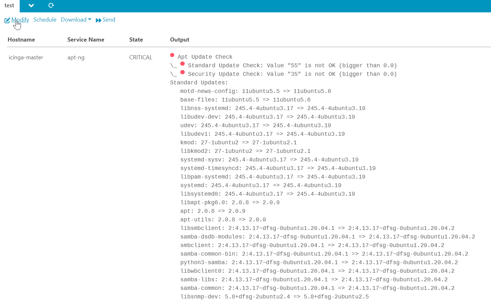

# About the Checkreports Module 

This module provides the ability to generate reports with the check output as report data

Please read the following chapters for more insights on this module:

* [Installation](doc/02-Installation.md#module-checkreports-installation)
* [Configuration](doc/03-Configuration.md#module-checkreports-configuration)
* [Usage](doc/04-Usage.md#module-checkreports-usage)

## Source

This module is based on idoreports and icingaweb-web.

## Contributing

There are many ways to contribute to this Icinga Web module -- whether it be sending patches, testing, reporting bugs,
or reviewing and updating the documentation. Every contribution is appreciated!
