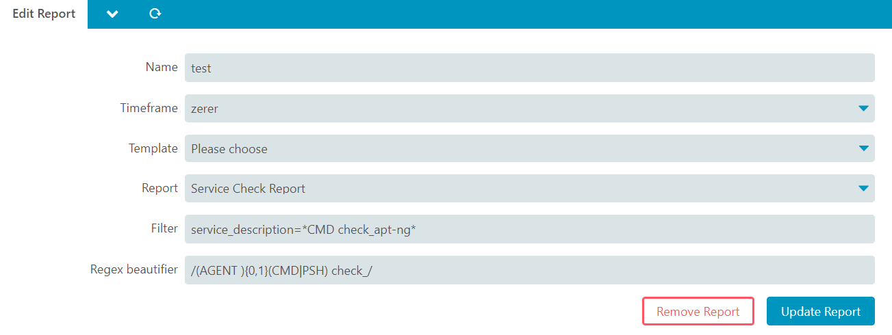

# Configuration 

## Report Configuration  

The name of the report is Service Check Report

| Option                | Required | Description                              |
| --------------------- | -------- | -----------------------------------      |
| Name                  | **yes**  | Name of the report                        |
| Timeframe             | **yes**  | You can use any Timeframe, but it will not be used anyway|
| Template             | no       | You can choose your report template                       |
| Report              | no       | Choose Service Check Report                       |
| Filter              | no       | Use a filter to narrow down the report                        |
| Regex beautifier    | no       | This Regex will be used to remove every match out of the service name in order to reduce redundancy |

